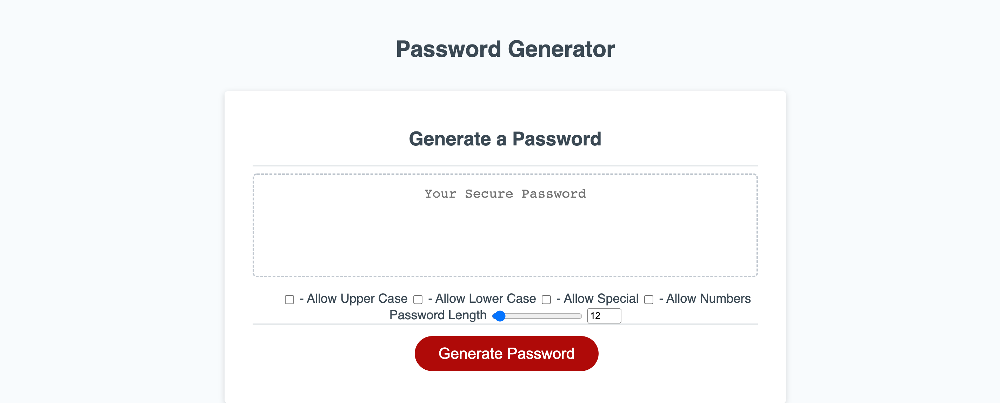
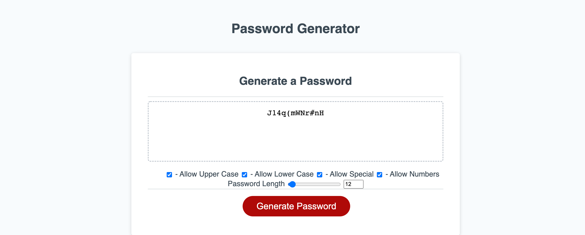

# Password Generator

-----
## Description:

User is able to select password criteria (upper/lower case, special characters, numbers, and length) and the site will create a password using the requested criteria.

-----
## Images:

-----
## Site URL:

- [Password Generator](https://ksjefferies.github.io/password-generator/)

-----
## Github Repository:

- [Github Repository for Password Generator](https://github.com/ksjefferies/password-generator)

## Author:

- [Kelly Jefferies](https://github.com/ksjefferies)

## Technologies Used:

  

## License:

